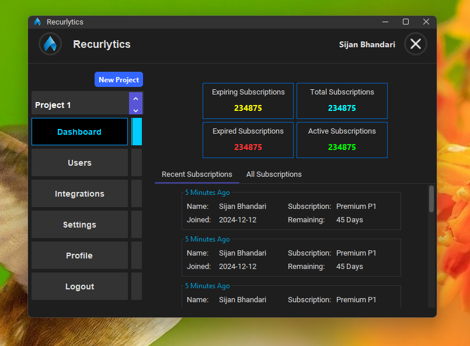

# Recurlytics Desktop

Recurlytics Desktop is a comprehensive application designed to manage projects, users, and subscriptions efficiently. It provides a user-friendly interface to execute actions via SDK or REST APIs, making it an essential tool for developers and project managers alike.



## Features

- **Project Management**: Create, update, and manage your projects seamlessly.
- **User Management**: Add, edit, and remove users with ease.
- **Subscription Management**: Keep track of subscriptions and manage them effectively.
- **Action Execution**: Execute actions using SDK or REST APIs effortlessly.

## Installation

### Prerequisites

- Java Development Kit (JDK) 11 or higher
- Apache Maven 3.6.3 or higher
- Netbeans IDE (Recommended) or Intellij or both

### Clone the Repository

```bash
git clone https://github.com/yourusername/recurlytics-desktop.git
cd recurlytics-desktop
```

### Build the Application

```bash
mvn clean install
```

### Run the Application

```bash
mvn exec:java
```

